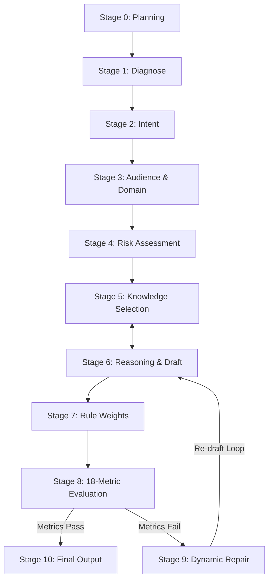

# Arabic Intelligence Framework

A modular reasoning framework for Arabic UX writing, product copy, and AI agents.

[](https://github.com/theonlym7md/arabic-ai-skills)
[](LICENSE)
[](tests/skill.test.js)

---

## 📌 Versioning Alignment
`Framework Spec: v1.2.0-STABLE | Skill Package: v1.2.0 | API Compatibility: 1.x`

---

## ❓ What is this?
Arabic Intelligence is a guided reasoning framework that provides a 10-stage decision graph for generating natural, human-grade, and culturally localized Arabic UX microcopy, product copy, and interface messaging.

## 💡 Why does it exist?
Standard LLMs struggle with Arabic product copy—defaulting to literal English translations, robotic administrative clichés (*"في إطار حرصنا المستمر"*, *"يرجى التكرم بالعلم"*), and high cognitive load. Arabic Intelligence eliminates AI slop via ontological rule graphs, anti-example cliché bans, and an 18-metric rubric.

## 👤 Who is it for?
- **AI Agent Engineers & Prompt Designers:** Adding Arabic product copywriting capabilities to agents.
- **Product Managers & UX Writers:** Standardizing localized Arabic UX copy across platforms.
- **GovTech, FinTech & E-Commerce Teams:** Enforcing authentic regional phrasing (Saudi & Gulf).

---

## ⚡ Quick Example

### ❌ Raw AI Output (Robotic Cliché Slop)
> *"في إطار حرصنا المستمر على تقديم أفضل الخدمات، يرجى التكرم بالعلم بأنه لا يوجد لديكم أي مخالفات مرورية حالياً."*

### ✅ Arabic Intelligence Framework Output (v1.2.0-STABLE)
> **العنوان:** "سجلك خالي من المخالفات"  
> **الوصف:** "لا توجد أي مخالفات مرورية مسجلة بحقك حالياً. نتمنى لك قيادة آمنة."

---

## 🚀 Quick Install

Add the skill directly to your Claude Code, Cursor, Antigravity, or Agent CLI:

```bash
npx skills add https://github.com/theonlym7md/arabic-ai-skills --skill arabic-uiux-master
```

Or programmatically via Node.js SDK:
```typescript
import { generateArabicCopy } from 'arabic_skill';

const result = await generateArabicCopy({
  apiKey: process.env.OPENAI_API_KEY!,
  projectNiche: 'GovTech',
  targetAudience: 'Saudi Citizens',
  toneOfVoice: 'Official & Clear',
  textType: 'Empty State',
  context: 'Traffic violation page with zero fines'
});
```

---

## 🧠 Architecture Topology



---

## ⚖️ Capability Matrix

| Category | Status | Capabilities & Directives |
| :--- | :---: | :--- |
| **GovTech & Official** | `Production / Stable` | Saudi & Gulf GovTech tone, empty states, official notices |
| **FinTech & Payments** | `Production / Stable` | Payment friction removal, checkout retry, trust anchors |
| **SaaS & Landing Pages** | `Production / Stable` | Hero value propositions, CTAs, feature cards |
| **E-Commerce** | `Production / Stable` | Cart recovery, transactional alerts, product copy |
| **Media & Content** | `Production / Stable` | Podcasts, White Dialect Arabic, youth-focused copy |
| **Healthcare** | `Experimental` | Patient onboarding, appointment booking |
| **Legal Contracts** | `Unsupported` | *Not supported. Requires specialized legal counsel.* |
| **Medical Diagnostics** | `Unsupported` | *Not supported. Requires licensed medical evaluation.* |
| **Marketing Spam** | `Unsupported` | *Forbidden by framework ethical rules.* |

---

## 📂 Protocol Specifications & Developer Tools

- 📜 **Protocol Specification:** Read [SPEC.md](SPEC.md) for formal stage contracts, error codes, & runtime SDK specs.
- 📑 **Compatibility Spec:** Read [docs/COMPATIBILITY.md](docs/COMPATIBILITY.md).
- 📑 **CI Pipeline Specification:** Read [docs/CI_PIPELINE.md](docs/CI_PIPELINE.md).
- 📑 **Architecture Decision Records:** Read [ADR-001](docs/adr/ADR-001-why-working-memory.md), [ADR-002](docs/adr/ADR-002-why-ontology.md), and [ADR-003](docs/adr/ADR-003-why-plugins.md).
- 📊 **Benchmark Methodology:** Read [benchmarks/README.md](skills/arabic-intelligence/benchmarks/README.md) for rubric evaluation details.
- 🛠️ **Universal System Validator:** Run `node scripts/validate_all.js`.
- 📦 **Pristine Clean Packaging:** Run `node scripts/package_zip.js` to build a clean distribution zip (excluding `.git` & `node_modules`).
- 🤝 **Contributing:** Check our [CONTRIBUTING.md](CONTRIBUTING.md) guide before submitting PRs.

---

<div align="center">

**Core API Frozen & STABLE 1.2.0.**

</div>
