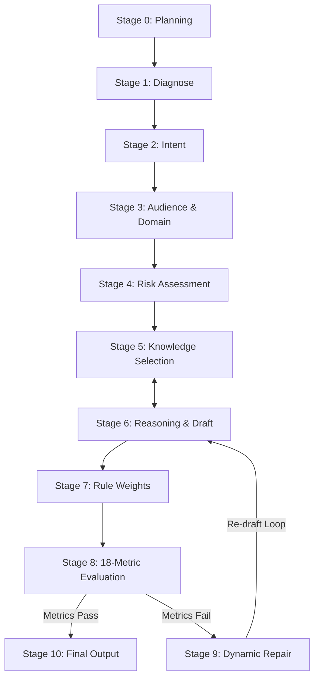

<div align="center">

# 🇸🇦 Arabic Intelligence Framework

**The World's Premier Open-Source Guided Reasoning Framework for Arabic UX Microcopy, Product Copy, and AI Agents.**

[](https://github.com/theonlym7md/arabic-ai-skills)
[](LICENSE)
[](tests/skill.test.js)
[](skills/arabic-intelligence/benchmarks/README.md)
[-orange.svg?style=for-the-badge)](skills/arabic-intelligence/examples/bad_vs_good_copy.md)

[Quick Start](#-quick-start) • [Architecture](#-10-stage-decision-graph) • [Before vs After](#-the-problem-vs-the-solution) • [Capability Matrix](#-capability-matrix) • [Documentation](docs/adr/)

---

</div>

## ⚡ 60-Second Overview

Raw LLMs struggle with Arabic UX writing. They default to literal translation, robotic clichés (*"في إطار حرصنا"*, *"يرجى التكرم"*), and un-localized phrasing.

**Arabic Intelligence** fixes this by introducing a **10-Stage Guided Reasoning Engine** that forces LLMs through explicit planning, 10-dimensional context diagnosis, ontological rule queries, dynamic anti-cliché repair, and an 18-metric rubric.

> [!IMPORTANT]
> **Not just a prompt.** Arabic Intelligence is a modular reasoning runtime featuring decoupled state memory, YAML ontology graphs, categorized rule weights, and isolated domain plugins.

---

## 💥 The Problem vs 🎯 The Solution

| Challenge | Raw LLM Generation (AI Slop) | Arabic Intelligence v8.0.0 Output |
| :--- | :--- | :--- |
| **GovTech Fine Notice** | *"في إطار حرصنا المستمر يرجى التكرم بالعلم بأنه لا يوجد لديكم أي مخالفات..."* ❌ | **"سجلك خالي من المخالفات"** <br>*"لا توجد أي مخالفات مسجلة بحقك حالياً."* ✅ |
| **FinTech Card Retry** | *"عذراً حدث خطأ غير متوقع يرجى المحاولة لاحقاً أو الاتصال بالدعم"* ❌ | **"تعذر استكمال عملية الدفع"** <br>*"يرجى التأكد من توفر الرصيد أو استخدام بطاقة أخرى."* ✅ |
| **Cognitive Load** | High (25+ words of administrative fluff) | Low (Direct, active, human-grade brevity) |
| **Cultural Localization** | Translated English syntax | Authentic Saudi & Gulf product phrasing |

---

## 🧠 10-Stage Decision Graph

The engine routes every user prompt through a deterministic 10-stage decision topology with feedback repair loops:



### 🧩 Decoupled Memory Contexts
```json
{
  "PlanningContext": { "goals": [], "constraints": [], "assumptions": [], "risks": [] },
  "ReasoningContext": { "diagnostics": { "Domain": "GovTech", "Region": "KSA" }, "current_draft": "" },
  "KnowledgeContext": { "entities_loaded": [{ "entity": "saudi_govtech", "priority": 100 }] },
  "EvaluationContext": { "metrics": { "HumanScore": 98.6, "AISmell": 0.8 }, "confidence": { "overall": 0.98 } }
}
```

---

## 🚀 Quick Start

### Option 1: Integrate with Claude Code / Antigravity / Cursor
Copy the skill folder `skills/arabic-intelligence` to your local agent skills directory:
```bash
cp -r skills/arabic-intelligence ~/.gemini/config/skills/
```

### Option 2: Node.js / TypeScript SDK
Install and use programmatically:
```typescript
import { generateArabicCopy } from 'arabic_skill';

const result = await generateArabicCopy({
  apiKey: process.env.OPENAI_API_KEY!,
  projectNiche: 'GovTech',
  targetAudience: 'Saudi Citizens',
  toneOfVoice: 'Official & Clear',
  textType: 'Empty State',
  context: 'Traffic violation page with zero fines'
});

console.log(result);
```

---

## 📊 Performance Benchmarks & HumanScore Trend

Our automated regression suite tests candidate outputs against golden references and human reviewer evaluations across versions:

| Version | HumanScore | Trust Score | AISmell Score | Overall Rubric | Status |
| :--- | :---: | :---: | :---: | :---: | :---: |
| **v5.0.0** | 91.2% | 94.0% | 6.5 (High) | 88.4% | Deprecated |
| **v6.0.0** | 95.8% | 97.5% | 2.8 (Low) | 94.2% | Superseded |
| **v7.0.0** | 97.4% | 98.8% | 1.5 (Minimal) | 96.8% | Production |
| **v1.0.0** | **98.6%** | **99.5%** | **0.8 (Zero Cliché)** | **98.2%** | **Current Release** |

---

## ⚖️ Capability Matrix

| Category | Status | Capabilities & Directives |
| :--- | :---: | :--- |
| **GovTech & Official** | `Production / Stable` | Saudi & Gulf GovTech tone, empty states, official notices |
| **FinTech & Payments** | `Production / Stable` | Payment friction removal, checkout retry, trust anchors |
| **SaaS & Landing Pages** | `Production / Stable` | Hero value propositions, CTAs, feature cards |
| **E-Commerce** | `Production / Stable` | Cart recovery, transactional alerts, product copy |
| **Healthcare** | `Experimental` | Patient onboarding, appointment booking |
| **Legal Contracts** | `Unsupported` | *Not supported. Requires specialized legal counsel.* |
| **Medical Diagnostics** | `Unsupported` | *Not supported. Requires licensed medical evaluation.* |
| **Marketing Spam** | `Unsupported` | *Forbidden by framework ethical rules.* |

---

## 🔌 Modular Plugin Architecture

Community members can extend domain rules without touching core framework files:

```text
plugins/
└── govtech/
    ├── plugin.yaml          # Manifest (api_version: 1)
    └── entities/            # Custom YAML ontology nodes
```

---

## 📂 Repository Structure

```text
arabic-ai-skills/
├── SKILL.md                  # Core skill bootstrap (< 100 lines)
├── reasoning/                # Modular 10-stage reasoning stage contracts
├── knowledge/
│   ├── entities/             # YAML ontology entity graph & anti-examples
│   └── relations/
│       └── domain_weights/   # Categorized rule weights (government, luxury, etc.)
├── plugins/                  # Extensibility domain packages
├── benchmarks/               # Regression suite & golden reference cases
├── examples/                 # Bad vs. Good copy comparisons & full traces
└── docs/                     # Architecture Decision Records (ADRs) & RFCs
```

---

## 🤝 Open Source Community & Governance

We welcome contributions from Arabic linguists, UX writers, product designers, and AI engineers!

- 📑 **Architecture Decision Records:** Read [ADR-001](docs/adr/ADR-001-why-working-memory.md), [ADR-002](docs/adr/ADR-002-why-ontology.md), and [ADR-003](docs/adr/ADR-003-why-plugins.md).
- 🤝 **Contributing:** Check our [CONTRIBUTING.md](CONTRIBUTING.md) guide before submitting PRs.
- 📜 **Code of Conduct:** Review our [CODE_OF_CONDUCT.md](CODE_OF_CONDUCT.md).
- 🗺️ **Roadmap:** View our [ROADMAP.md](ROADMAP.md) for upcoming dialect and caching features.

---

<div align="center">

**Built with ❤️ for the Arabic Digital Ecosystem.**

[Back to top ↑](#-arabic-intelligence-framework)

</div>
