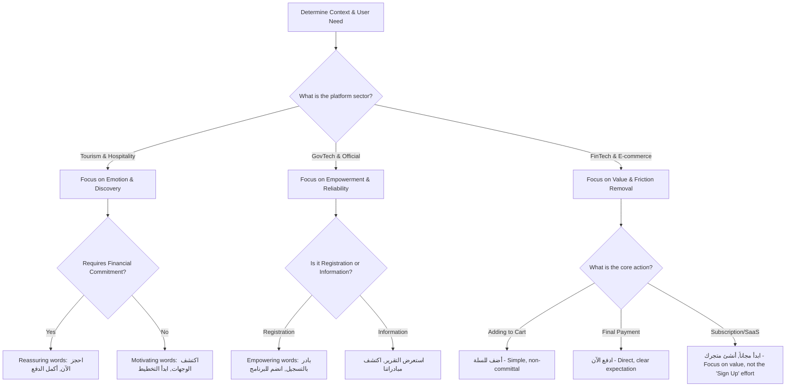

# UI Psychology: CTA Decision Tree (هندسة أزرار الإجراء)

## Concept
A CTA (Call to Action) is not just a button; it is the culmination of the user's decision-making process. The words on the CTA must match the user's intent and lower their anxiety about clicking.

## The CTA Decision Tree

## Anti-Patterns (The "Never Use" List)
Do NOT use these words on buttons. They are translated, boring, and increase friction:
*   ❌ **إرسال (Submit):** Too technical. Sounds like a database operation. Use "تأكيد" or "انضم الآن".
*   ❌ **تقديم (Submit/Apply):** Ambiguous. Use "قدم طلبك" or "أرسل الطلب".
*   ❌ **دفع (Pay):** Naked and scary. Frame it contextually (e.g., "أكمل الدفع", "ادفع بأمان").

## The "Value vs. Effort" Rule
Always write CTAs that highlight the **Value** the user gets, not the **Effort** they have to put in.
*   *Effort (Bad):* "سجل حساباً جديداً" (Requires work).
*   *Value (Good):* "ابدأ رحلتك معنا" or "أنشئ متجرك مجاناً" (Promises a result).
